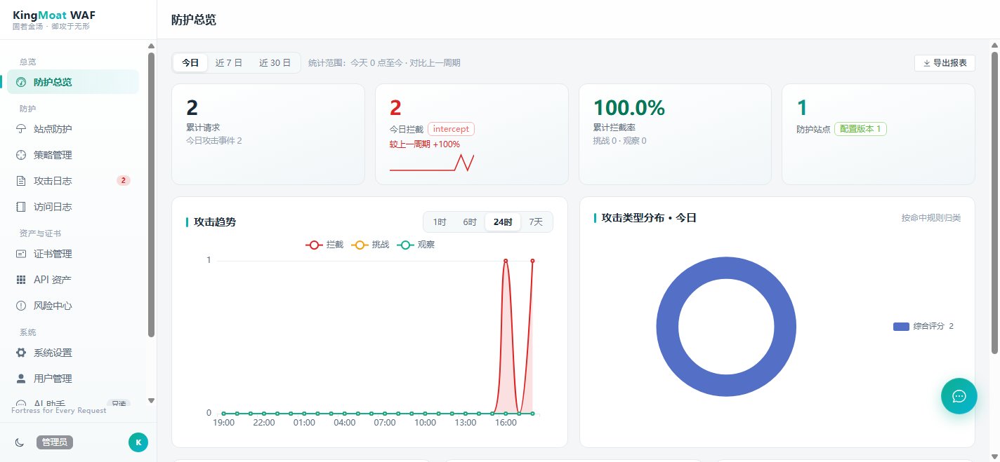
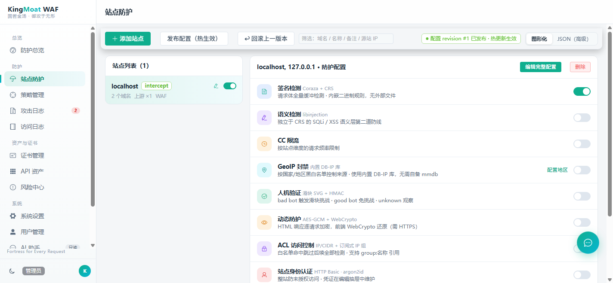
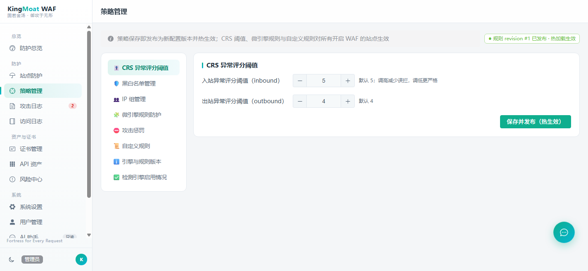
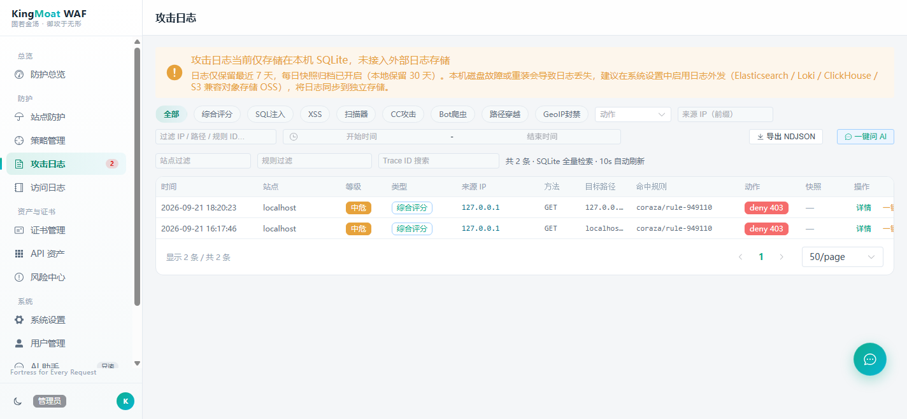
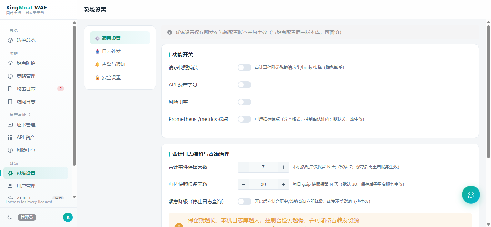
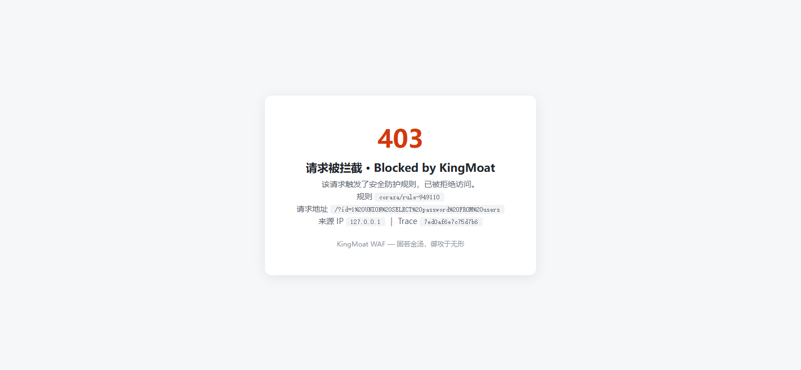

<h1 align="center">KingMoat WAF</h1>

<p align="center">
  <b>固若金汤，御攻于无形</b> · Fortress for Every Request
</p>

<p align="center">
  <a href="https://opensource.org/license/mulanpsl-2-0"></a>
  <a href="https://gitee.com/kingmoat/KingMoat-WAF/releases"></a>
  
  
</p>

<p align="center">
  <a href="README.md"></a>
  <a href="README_EN.md"></a>
</p>

KingMoat 是一个开源、纯 Go 实现的 **All-in-one Web 应用防火墙**：自研 L7 反向代理承载流量，Coraza（ModSecurity SecLang 兼容引擎）+ OWASP CRS 4.x 作为签名检测核心，单二进制运行，配置默认存 SQLite，开箱即用。

> **⚠️ AI 生成声明**：本项目代码**绝大部分由 AI 辅助生成**，经人工审查与自动化测试/安全评审迭代后发布。我们选择公开这一事实：它证明了 AI 编程在中小规模安全产品上的可用性，也意味着它比典型人工项目更需要社区 Review——发现任何问题请直接提 Issue，我们认真对待每一条。

## 💡 为什么做 KingMoat WAF

主流开源 WAF 对个人站长和中小团队并不友好——要么限制站点数量，要么部署偏重（以下事实截至 2026-09，均附来源）：

| 项目 | 许可证 | 站点/服务数 | 部署形态 |
|---|---|---|---|
| 雷池 SafeLine 社区版 | 社区版协议（2025 起明确禁止商业用途） | 新装实例限 **10 个**防护站点（7.6.0 起；2024-08 起曾为 50 个），免费版性能受限（5.4.0 起） | Docker Compose 多容器 |
| BunkerWeb | AGPL-3.0 | 社区版不限，但 Anti-DDoS、高级 ACME 等进阶插件为 PRO 付费项，单个 PRO 授权限 100 个服务 | scheduler + NGINX + UI 多容器 |
| ModSecurity / Coraza + Nginx | Apache-2.0（引擎本体） | 不限 | 引擎级组件：需自行集成、调优规则、维护日志，非开箱产品 |
| **KingMoat** | **MulanPSL-2.0** | **不限站点数、不限并发** | **单二进制 + SQLite，装完即用** |

来源：[SafeLine 官方文档](https://help.waf-ce.chaitin.cn/)、[SafeLine GitHub](https://github.com/chaitin/SafeLine)、[社区版站点限制变更解析](https://blog.gitcode.com/0afe30162fd57701b513c6ed6fab6093.html)、[BunkerWeb GitHub](https://github.com/bunkerity/bunkerweb)、[BunkerWeb 定价页](https://www.bunkerweb.io/pricing-plan/)。

小团队的真实诉求很朴素：**装得上、看得懂、管得过来**。KingMoat 据此选择了一条不同的路线：不设站点与并发配额、规则内嵌权威上游、单文件部署、图形化控制台，欢迎个人站长与中小规模团队使用。

## ✨ 核心特性

**🚫 不限量**

- 站点数与并发不设限（无许可证配额，性能随硬件扩展）；单二进制即可承载多站点 Host 路由、加权轮询、主动健康检查 + 被动熔断、SNI 多证书 TLS、WebSocket 透传

**🛡️ 权威上游规则**

- Coraza v3 + OWASP CRS 4.x 直接嵌入二进制（无外部规则文件，离线可用），请求体全量缓冲检测
- libinjection SQLi/XSS 语义层，独立于 CRS 的第二道防线
- CRS 阈值、黑白名单、IP 组订阅、微引擎自定义规则均可在控制台图形化配置；攻击日志一键加白自动生成放行规则（幂等，防重复）

**🤖 AI 安全助手（只读）**

- 内嵌 LLM 安全分析师：SSE 流式对话、攻击日志一键问 AI、定时日报与突增主动报告、Webhook/邮件外发
- OpenAI 兼容多模板（DeepSeek/通义/智谱/Kimi/豆包/Ollama…）+ 自定义接入
- 出站动态脱敏（[ENT]/[USR]/[NET]/[INF]/[SEC] 占位符，返回自动还原，可开关）；硬编码只读工具表，无任何写路径；可选 MCP 端点（[docs/AI.md](docs/AI.md)）

**🎯 风险引擎与资产梳理**

- R1–R7 observe-only 风险引擎：敏感暴露 / 未授权线索 / 登录爆破 / 影子 API / 僵尸 API / 管理面暴露 / 明文敏感参数，风险页 + webhook
- API 资产梳理：响应后观测旁路学习 API 清单（路径归一化 + 标签 + 候选降噪，独立 SQLite 库，默认关）
- BOT 爬虫识别：UA 三分类 + 客户端指纹 + 频率信号，与 JS 挑战联动

**🔒 数据面防护全家桶**

- CC 限流（固定窗口，deny/throttle）、滑块验证码（SVG + HMAC 通行 Cookie）、轻量 JS 质询
- IP/CIDR 黑白名单 + 订阅式 IP 组、GeoIP 国家黑白名单（自备 mmdb）
- 整站 HTTP Basic（argon2id）、HTTPS 308 跳转、真实客户端 IP 识别（trusted proxies）
- 响应过滤：敏感信息脱敏/阻断（手机号/身份证/密钥预设 + 自定义正则）
- 动态防护：HTML 响应逐请求 AES-GCM 加密 + WebCrypto 还原（需 HTTPS）
- 双模式：`intercept` 命中即拦 / `monitor` 只记录不拦截（新站灰度）；上游故障 502 友好页
- 审计日志：NDJSON 按天滚动 + 内存环实时查询，可选请求快照捕获（脱敏）

**⚙️ 控制面与可运维性**

- SQLite 版本化配置库：revision 追加不可改写、一键回滚；热更新原子生效，发布失败自动保留旧配置
- Web 控制台（Vue 3）：暗色科技感界面，站点防护图形化配置、攻击日志、证书、API 资产、风险、AI 助手；RBAC 三级（admin/operator/auditor）+ MFA + API Key；构建产物 embed，部署仍是单文件
- 证书管理：站点 PEM + Let's Encrypt 自动申请续签（ACME，TLS-ALPN-01 + HTTP-01）
- 告警与外发：webhook 事件推送；Elasticsearch / Loki / Kafka 日志外发
- Prometheus `/metrics`、REST API 全量管理面（[docs/API.md](docs/API.md)）

## 📸 界面预览

| 防护总览 | 站点防护 |
|:---:|:---:|
|  |  |
| **策略管理**（CRS 阈值 / 名单 / 微引擎 / 引擎状态） | **攻击日志**（规则命中 / 一键问 AI） |
|  |  |
| **安全设置**（密码策略 / 拦截页定制） | **拦截生效**（CRS 命中即拦） |
|  |  |

**社区版范围说明**：本仓库为社区版，聚焦单机 All-in-one 场景，部署形态：**all-in-one（推荐）** / 静态配置文件。如果您需要多节点集中管理（节点管理）、界面品牌个性化定制或其他功能性定制，请联系作者。

> **📊 匿名安装统计（默认关闭）**：本产品内置可选的匿名安装统计，帮助我们了解部署规模与版本分布。**默认关闭**——你需要在「系统设置 → 通用设置 → 匿名安装统计」显式开启。开启后仅上报随机安装 ID、软件版本、操作系统架构与安装方式，**不采集主机名、用户名、内网 IP 或任何业务数据**；支持行业标准 `DO_NOT_TRACK` 环境变量一键关闭；连续 3 次无法连接统计服务会自动停止上报。作为安全产品，我们选择把这一切摆在明面上：代码可审、开关在你的手里。

## 🚀 快速开始（all-in-one）

从 [Releases](../../releases) 下载对应平台的二进制（或按下文自行构建），然后：

```bash
# 1. 启动一个示例上游（任选）
python3 -m http.server 9000

# 2. 生成控制台管理员凭证（可选但建议）
export KINGMOAT_ADMIN_HASH=$(kingmoat-cli hash-password -password 'YourStrongPassw0rd!')
# 可选两步验证：export KINGMOAT_ADMIN_TOTP=<base32密钥>

# 3. 启动 KingMoat：数据面 :8080 + 控制台 :8081，配置存入 kingmoat.db（SQLite）
kingmoat -config config.example.json -console-addr 127.0.0.1:8081

# 4. 验证拦截
curl -i -H "Host: localhost" "http://127.0.0.1:8080/?id=1 UNION SELECT password FROM users"
# → 403 拦截（X-Kingmoat-Rule: coraza/rule-949110），事件写入审计日志库 logs/audit.db

# 5. 打开控制台发布/修改配置（热生效，无需重启）
#    https://127.0.0.1:8081/
```

> 默认管理员账号：`kmadmin` / `KingMoat@2026`，首次登录强制修改密码。请立即设置强口令；若控制台需绑定到非本机回环地址，务必先用第 2 步的 `KINGMOAT_ADMIN_HASH` 预设强口令，避免已知默认凭据被抢先登录。

Docker / systemd / Windows 服务化等部署方式见 [deploy/README.md](deploy/README.md)（部署总览、前置规划与上线检查单；同目录含 distroless Dockerfile、docker-compose、kingmoat.service、windows.md）。

## 🧰 从源码构建

依赖：Go 1.26+、Node.js 18+（前端构建用）。

```bash
# 一键构建三平台发布包（自动完成前端构建、dist 回填、第三方许可清单）
./scripts/build.sh <版本号>          # Linux / macOS
.\scripts\build.ps1 -Version <版本号>  # Windows（支持 windows/amd64、linux/amd64、linux/arm64）

# 或手动分步
(cd web/console && npm install && npm run build)   # 构建控制台前端
# 将 web/console/dist 产物回填 internal/webui/dist（go:embed 目录）
go build ./...
```

## 开发

```bash
go build ./...   # 构建
go vet ./...     # 静态检查
go test ./...    # 单元 + 集成测试（CRS 检测回归 / 配置中心 / API / 热更新）
```

CI：`.github/workflows/ci.yml`（build / vet / test）。架构设计与依赖许可证合规策略见 [docs/ARCHITECTURE.md](docs/ARCHITECTURE.md)；配置字段级说明见 [docs/CONFIG.md](docs/CONFIG.md)；更新历史见 [CHANGELOG.md](CHANGELOG.md)。

## 📚 作为库嵌入（SDK 模式）

```go
package main

import (
    "net/http"

    "github.com/kingmoat/kingmoat/pkg/kingmoat"
)

func main() {
    eng := kingmoat.New(kingmoat.Options{
        Mode: kingmoat.ModeMonitor, // 先观察，后拦截
    })
    http.ListenAndServe(":8080", eng.Handler(yourHandler))
}
```

## 参与贡献

欢迎通过 Issue 提交问题与建议，通过 Pull Request 参与贡献。再次提醒：本项目代码以 AI 生成为主，PR 的 Review 尤其欢迎——从安全、正确性到工程品味，任何角度的意见都有价值。安全漏洞请勿直接公开提 Issue，优先私下联系维护者。提交遵循 DCO（`git commit -s`）。

如需**多节点集中管理、界面品牌个性化定制或其他功能性定制**，或需要**有偿技术支持**，请联系作者：[ailife2@126.com](mailto:ailife2@126.com)。

## 许可证

[木兰宽松许可证 第2版（Mulan PSL v2）](https://opensource.org/license/mulanpsl-2-0)（中英双语、含专利授权、与 Apache-2.0 双向组合兼容），见 [LICENSE](LICENSE) 与 [NOTICE](NOTICE)；中文文本为准。第三方依赖与规则集（Coraza、OWASP CRS、libinjection 等）各自沿用其原许可证（Apache-2.0/MIT/BSD 等），来源与许可证清单见 [THIRD-PARTY-LICENSES](THIRD-PARTY-LICENSES)。
